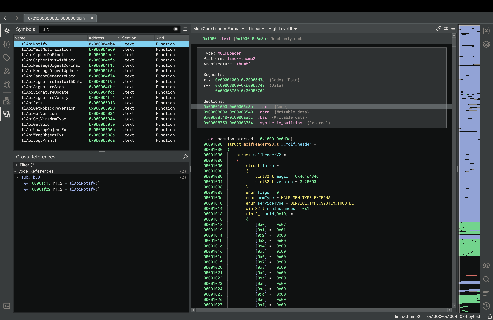

# MobiCore Loader Format (v0.0.3)
Author: **vrzh**

_Loader for MobiCore trustlets and secure drivers_

## Description:
MCLF is a format for MobiCore trustlets and drivers. This plugin will map the trustlet/secure driver and resolve known calls to `mcLib`.



## Installation Instructions
To install, clone this repo into the Binary Ninja plugin directory `Plugins->Open Plugin Folder...`:

`$ git clone https://github.com/v-rzh/mclf-binja-loader.git`

When installing a release, untar/unzip the release into that directory:
```s
$ tar xzvf mclf-binja-loader-x.x.x.tar.gz
$ mv mclf-binja-loader-x.x.x mclf-binja-loader
```


## Minimum Version

This plugin requires the following minimum version of Binary Ninja:

* 3233


## License

This plugin is released under a MIT license.
## Metadata Version

2
